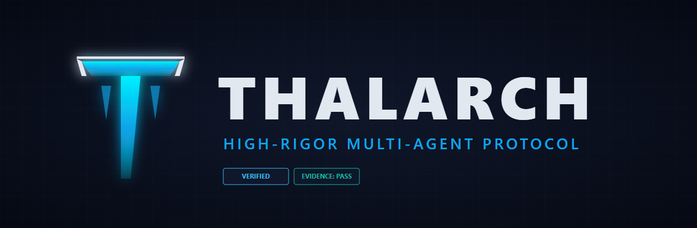
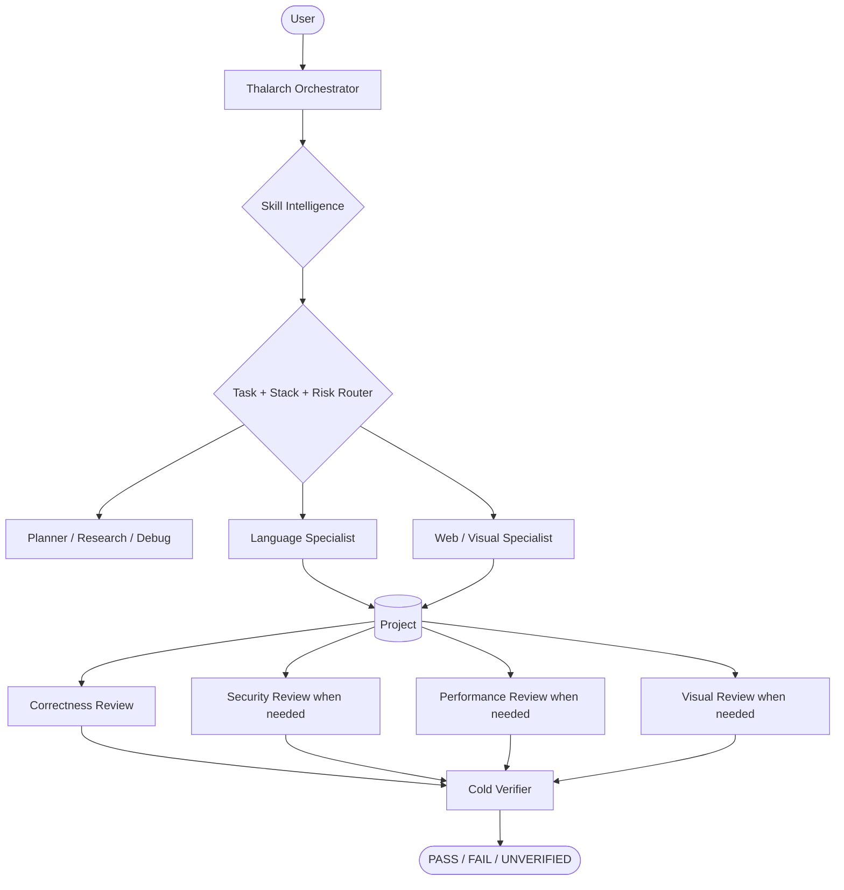

<div align="center">



<br/>

**High-rigor, project-agnostic engineering + visual-production protocol for Google Antigravity.**

[](LICENSE)
[](#installation)
[](CHANGELOG.md)
[](.github/workflows/validate.yml)

</div>

---

## What is Thalarch?

**Thalarch 1.0.0** is an Antigravity-native multi-agent harness for serious software engineering,
web design, and visual production.

It is built around a simple idea: a coding agent should not jump from a request straight into
editing. It should first understand the project, choose the strongest relevant skills, route work
to the right specialist, verify version-sensitive APIs, keep scope tight, review independently,
and prove the final result with evidence appropriate to the claim.

Thalarch is intentionally **user-, repository-, language-, framework-, and operating-system
agnostic**. It does not assume Android, web, Gradle, Node, Python, or any other stack until the
repository proves it.

> Thalarch improves the engineering process around the underlying model. It does not claim to
> change the model's intrinsic reasoning capability.

### Permanent version policy

The public version is intentionally fixed at **`1.0.0`**. Capabilities can evolve continuously,
but Thalarch does not bump the public version number. Git history and this repository's changelog
record capability changes.

---

## Autonomous Skill Intelligence

You should not need to tell Thalarch which skill to use.

At the beginning of meaningful work — and again after repository discovery when necessary —
Thalarch inspects the skills available in the current Antigravity session by name and description,
then selects the **smallest high-value compatible stack**.

Selection considers:

- exact task fit;
- project-local knowledge;
- actual language/framework/toolchain versions;
- official/vendor authority and currentness;
- tool and evidence leverage;
- redundancy/conflicts;
- context cost.

Typical priority:

**user/repository constraints → project-local skills → current official platform skills → Thalarch
specialists → trusted community skills → generic fallback reasoning.**

Thalarch can also drop a skill after investigation proves it irrelevant. More skills are not
automatically better.

Known high-value ecosystems are used only as discovery/tie-breaking hints. If the relevant skill is
not actually installed or does not match the project, Thalarch does not pretend to have loaded it.

---

## Polyglot engineering

Thalarch has dedicated project-aware coding specialists instead of one generic prompt pretending to
be equally expert in every language.

| Language / stack | Skill | Specialist agent |
| --- | --- | --- |
| Java / JVM | `thalarch-java` | `thalarch-java-engineer` |
| Kotlin / JVM / Android / KMP | `thalarch-kotlin` | `thalarch-kotlin-engineer` |
| Python | `thalarch-python` | `thalarch-python-engineer` |
| TypeScript / JavaScript | `thalarch-typescript` | `thalarch-typescript-engineer` |
| Go | `thalarch-go` | `thalarch-go-engineer` |
| Rust | `thalarch-rust` | `thalarch-rust-engineer` |

The language specialist must discover the repository's real runtime/compiler, package/build system,
framework versions, test stack and conventions before editing.

### Deep engineering overlays

| Skill | Purpose |
| --- | --- |
| `thalarch-code-craft` | Minimal, idiomatic, repository-native coding and API-hallucination guard |
| `thalarch-debug` | Causal root-cause debugging before fixes |
| `thalarch-spec` | Observable acceptance contract for broad work |
| `thalarch-codebase-intel` | Bounded project/feature/dependency mapping |
| `thalarch-architecture` | Evidence-driven architecture decisions, boundaries and ADR-style tradeoffs |
| `thalarch-refactor` | Behavior-preserving restructuring |
| `thalarch-performance` | Runtime/build performance with comparable measurement |
| `thalarch-api` | API compatibility, errors, idempotency, retries and distributed boundaries |
| `thalarch-data-sql` | SQL, ORM, transactions, migrations and data-safe rollout |
| `thalarch-dependency` | Dependency/framework/toolchain changes with version verification |
| `thalarch-jvm-concurrency` | JVM thread safety, executors, futures, virtual threads and async correctness |
| `thalarch-kotlin-migration` | Semantics-preserving Java→Kotlin / Kotlin migration workflow |
| `thalarch-kotlin-jpa` | Kotlin-specific JPA/Hibernate identity, proxy, fetch and transaction correctness |
| `thalarch-test` | Regression, property, fuzz, concurrency and risk-based mutation testing |
| `thalarch-security` | Trust boundaries, authorization, dangerous sinks and agent/tool security |
| `thalarch-ci` | CI/build/release workflow diagnosis |
| `thalarch-git` | Git/GitHub publication boundaries and verification |

---

## Kotlin and JVM intelligence

When the current session has an exact official Kotlin/JetBrains skill for the proven task, Thalarch
prefers that specialist for current Kotlin facts rather than duplicating stale platform guidance.
Examples include Java→Kotlin conversion, JPA entity mapping, AGP/KMP migration and Kotlin/Native
build performance.

For Java/JVM work, Thalarch can add narrow concurrency, JPA, performance or migration expertise only
when those surfaces actually exist. Version-sensitive modern JVM APIs are verified against the
project's JDK and current primary documentation before implementation.

---

## Testing that can actually fail

Thalarch selects tests by what they prove:

1. unit/pure;
2. property/state-machine/model;
3. component/module;
4. real integration boundary;
5. device/browser/end-to-end.

It supports red-green regression proof, meaningful boundary matrices, property/metamorphic tests,
fuzzing, concurrency tests and **risk-based mutation testing**.

Coverage percentage is not treated as a quality score. Mutation testing is used selectively when
critical code can have high coverage but weak assertions. Mocks prove local collaboration; they do
not prove the external integration they replace.

---

## Architecture and performance

Architecture decisions start from existing modules, dependency direction, data ownership, runtime
boundaries and quality attributes — not from fashionable patterns. Thalarch compares plausible
alternatives, including the simplest one, and prefers reversible evolutionary migration over
unnecessary big-bang rewrites.

Performance work starts by defining a comparable scenario. Build-performance investigations, for
example, distinguish **local vs CI**, **debug vs release**, **cold vs warm/incremental/no-op**, and
the exact phase/task dominating the user's real command. A faster local loop must not silently
remove required release behavior from CI.

Unmeasured performance claims remain `UNVERIFIED`.

---

## Creative engineering

Thalarch treats visual quality as a real deliverable, not decoration.

Its visual stack includes:

- `thalarch-design-system` — extracts or creates one semantic visual system;
- `thalarch-web-design` — brief inference, art direction, responsive production UI and anti-template discipline;
- `thalarch-image-to-code` — screenshot/mockup/reference → measurable visual contract → real frontend;
- `thalarch-image` — routes inspect/generate/edit/vector/capture/compare/annotate/optimize tasks;
- `thalarch-imagegen` — disciplined native image generation/editing;
- `thalarch-visual-qa` — final asset metadata/fidelity/drift checks;
- `thalarch-browser-qa` — real browser interaction/screenshot/network/console evidence;
- independent web-design and vision reviewers.

The visual director owns image generation. The orchestrator deliberately does **not** have direct
image-generation authority.

---

## Design intelligence

Before designing, Thalarch creates a compact **Design Read** from the page kind, audience, brand,
references, trust requirements and the user's vibe words.

It calibrates three qualitative dimensions — **variance**, **motion**, and **density** — instead of
blindly using one house aesthetic for every site.

It actively resists common AI defaults such as purple glow everywhere, centered hero + three equal
cards, nested card shells, random pills, generic copy and motion on every element. Existing brand,
accessibility, regulated/public-sector constraints and project design systems outrank novelty.

When visual fidelity to a screenshot/mockup is central, `thalarch-image-to-code` extracts the actual
layout/type/spacing/color/crop contract before implementation and uses real browser screenshots as
final evidence. One unreadable giant design board is not considered a precise reference.

---

## Multi-agent architecture



The orchestrator coordinates but cannot directly edit project files or run shell commands.
Implementation and executable verification are structurally delegated.

---

## Evidence-first review

Thalarch uses independent review and deliberate perspective shifts to reduce self-review blind
spots: contract-before-body, caller/consumer view, failure-first analysis, bottom-up inspection for
tricky diffs, and “what breaks if this change disappears?”.

Unlike adversarial review systems that force every reviewer to find a problem, Thalarch allows a
**clean review**. A finding must have a concrete failure path and evidence; repeated speculation does
not become true because multiple agents repeated it.

The included `change_probe.py` can deterministically flag changed surfaces that may deserve
security, API, data, concurrency, build or visual review. Its output is routing evidence, not a
list of defects.

---

## Installation

### Windows / Antigravity IDE

```powershell
.\INSTALL.ps1 -Target IDE
```

### Linux / macOS / Antigravity IDE

```bash
chmod +x ./INSTALL.sh
./INSTALL.sh IDE
```

IDE installation target:

```text
~/.gemini/config/plugins/thalarch-mode
```

### Antigravity CLI

```text
agy plugin install ./thalarch-mode
```

Restart/reload Antigravity and select **`thalarch-orchestrator`** as the primary agent.

---

## Recommended prompt

```text
Use Thalarch.

Work end-to-end. Automatically inspect the skills available in this Antigravity session and choose
the strongest minimal stack for the actual project and task. Read repository rules and detect the
real languages, toolchains and framework versions before editing. Prefer project-local and current
official platform skills when they are better fits. Re-route after discovery if the evidence changes
the problem. Verify version-sensitive APIs instead of guessing them. Keep the diff minimal and
repository-native. Investigate root cause before fixing bugs. Use the real integration, browser,
device, database or performance evidence when the acceptance criterion lives there. Use independent
review appropriate to risk and cold-verify the final acceptance criteria. Do not push, merge,
publish, deploy or release unless I explicitly requested it.
```

---

## Validation

```bash
python validate_thalarch.py .
```

The validator checks, among other things:

- skill/agent structure and frontmatter;
- language specialists;
- autonomous skill-intelligence wiring;
- creative/image tool delegation;
- required advanced engineering skills/scripts;
- portable paths and stale branding;
- the permanent **`1.0.0`** version policy.

---

## Design heritage

Thalarch is an original Antigravity-native implementation. Its engineering and creative workflows
are informed by strong public patterns from projects such as Fable Mode, Superpowers, GitHub Spec
Kit / Awesome Copilot, official Kotlin agent skills, community JVM skill sets, Taste Skill, and
broad engineering skill libraries. Thalarch selectively synthesizes those ideas instead of copying
an entire external skill pack or inheriting rigid rules that do not generalize across projects.

---

## License

Released under the [MIT License](LICENSE).
