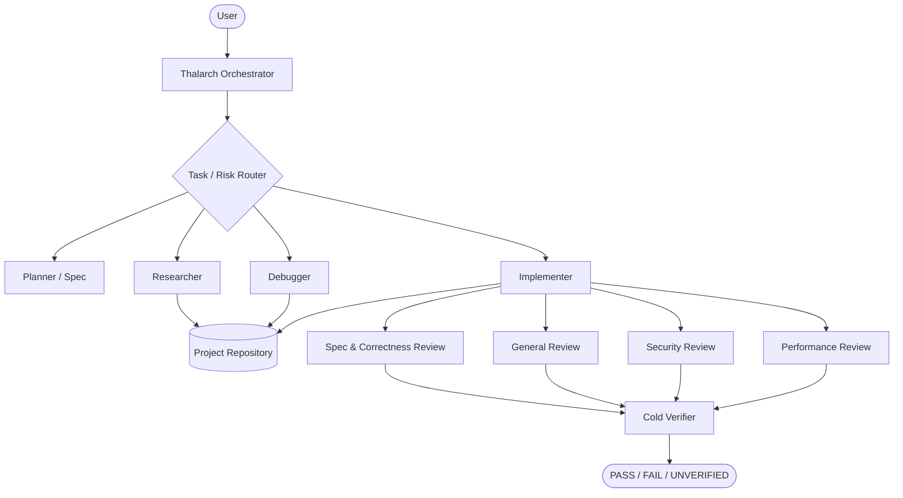

<div align="center">


<br/>

**High-rigor, project-agnostic multi-agent engineering protocol for Google Antigravity.**

[](LICENSE)
[](#installation)
[](CHANGELOG.md)
[](.github/workflows/validate.yml)

</div>

---

## Why Thalarch?

Coding agents are capable, but the failure modes are familiar: patching symptoms
before understanding the cause, widening scope, overloading the main context,
trusting their own implementation reports, and declaring success from evidence
that proves less than the final claim.

**Thalarch** is an Antigravity-native engineering harness designed to reduce those
failure modes. It separates planning, implementation, review, and verification;
routes each task through the smallest relevant specialist stack; and requires
fresh evidence before a result is called complete.

The core protocol is intentionally **language-, framework-, repository-, and
user-agnostic**. Android, UI, browser, security, CI, and Git behavior live in
focused optional skills and are loaded only when relevant.

> Thalarch improves the engineering process around the underlying model. It does
> not claim to change the model's intrinsic reasoning capability.

---

## What changed in 2.0

Version 1 established structural delegation and cold verification. Version 2
turns that foundation into a progressively disclosed engineering system:

- **task/risk router** instead of one heavy workflow for everything;
- **executable acceptance contract** for broad features and architecture work;
- **bounded codebase intelligence** for unfamiliar repositories;
- **causal debugging** with falsifiable hypotheses before fixes;
- **regression-test design** focused on proofs that can actually fail;
- **risk-sized review council** with independent spec, security, and performance lenses;
- **isolated research agent** for current docs, APIs, and external contracts;
- **UI/browser, Android, security, CI, and Git specialist skills**;
- **evidence ledger** for long-session recovery instead of relying on conversation memory;
- **self-evaluation suite** for testing Thalarch itself;
- **optional hard command gate** for consequential shell operations;
- **Windows, Linux, and macOS installation paths**;
- **repository validation CI**.

See [CHANGELOG.md](CHANGELOG.md) for the release summary.

---

## Architecture



The orchestrator is intentionally defined without project file-writing tools and
without shell execution. Mutation and executable checks are delegated to bounded
specialists rather than quietly performed by the coordinator.

---

## Agents

| Agent | Purpose | Mutates project files? |
| --- | --- | :---: |
| `thalarch-orchestrator` | Routes and coordinates the full workflow | No |
| `thalarch-planner` | Acceptance contract, architecture, execution plan | No |
| `thalarch-researcher` | Current documentation, APIs, external contracts | No |
| `thalarch-debugger` | Root-cause investigation and falsifiable diagnosis | No |
| `thalarch-implementer` | Executes one bounded change | **Yes** |
| `thalarch-reviewer` | Lightweight/general review path | No |
| `thalarch-review-spec` | Requirement compliance and correctness | No |
| `thalarch-review-security` | Threat-model and trust-boundary review | No |
| `thalarch-review-performance` | Performance and concurrency review | No |
| `thalarch-verifier` | Cold acceptance verification | No |

Review depth is proportional to risk. A one-line edit should not summon a review
council; a security-sensitive concurrency change should not receive a one-line
review.

---

## Skills

Thalarch 2.0 ships focused skills rather than one monolithic prompt:

| Skill | When it is useful |
| --- | --- |
| `thalarch-mode` | Core orchestration protocol |
| `thalarch-router` | Chooses the smallest relevant skill stack |
| `thalarch-spec` | Broad feature, refactor, migration, architecture |
| `thalarch-codebase-intel` | Large or unfamiliar repository |
| `thalarch-debug` | Bug, regression, failure, flaky behavior |
| `thalarch-test` | Regression and falsifiable test design |
| `thalarch-review` | Evidence-first risk-sized review |
| `thalarch-security` | Auth, input, secrets, tools, dependencies, workflows |
| `thalarch-ui` | Visual/interaction design and rendered evidence |
| `thalarch-browser-qa` | Real browser flow, console, network, responsive QA |
| `thalarch-android` | Kotlin, Compose, Gradle, Media3, device/runtime work |
| `thalarch-ci` | Build pipelines, GitHub Actions, packaging/signing |
| `thalarch-git` | Branch, commit, push, PR and publication workflow |
| `thalarch-compound` | Distills verified reusable project knowledge |
| `thalarch-evals` | Benchmarks and retunes Thalarch itself |

### Example routing

| Task | Typical stack |
| --- | --- |
| Small safe edit | General review only |
| Bug/regression | Debug → Test → Review → Verify |
| Multi-file feature | Spec → Test → Review → Verify |
| Architecture | Spec → Codebase Intel → Deep Review → Verify |
| UI change | Spec → UI → Browser/Runtime QA → Review → Verify |
| Security-sensitive change | Security → Review Council → Verify |
| CI failure | CI → Security when relevant → Review → Verify |
| Publish a branch/PR | Git → Review → Verify remote state |

---

## The core execution loop

1. **Route** — classify task and risk before loading heavy instructions.
2. **Understand** — read repository rules and the smallest necessary code surface.
3. **Specify** — convert broad intent into observable acceptance criteria.
4. **Investigate** — for failures, establish causal evidence before editing.
5. **Implement** — mutate only the bounded surface required by the task.
6. **Review** — use independent lenses sized to the actual risk.
7. **Verify** — cold-check acceptance criteria with fresh evidence.
8. **Compound** — keep only reusable, evidence-backed lessons from difficult work.

A successful compile proves compilation. It does not automatically prove runtime,
visual, network, integration, or device behavior. Thalarch deliberately keeps
those claims separate.

---

## Installation

### Antigravity IDE — Windows

From the repository root:

```powershell
.\INSTALL.ps1 -Target IDE
```

The installer copies `thalarch-mode` to:

```text
%USERPROFILE%\.gemini\config\plugins\thalarch-mode
```

### Antigravity IDE — Linux / macOS

```bash
chmod +x ./INSTALL.sh
./INSTALL.sh IDE
```

The plugin is installed to:

```text
~/.gemini/config/plugins/thalarch-mode
```

### Antigravity CLI

From any supported platform with `agy` available:

```text
agy plugin install ./thalarch-mode
```

Or use the included installer:

```powershell
.\INSTALL.ps1 -Target CLI
```

```bash
./INSTALL.sh CLI
```

After installation, restart/reload Antigravity and select
`thalarch-orchestrator` as the primary agent.

---

## Usage

Thalarch can route complex tasks automatically, but explicit activation is the
most deterministic way to test or demonstrate the protocol:

```text
Use Thalarch.

Work end-to-end. Route this task to the smallest relevant skill stack.
Investigate root cause before editing if this is a bug.
Keep the diff minimal and preserve repository conventions.
Use independent review appropriate to the risk.
Cold-verify the final acceptance criteria with fresh evidence.
Do not push, merge, publish, deploy, or release unless I explicitly requested it.
```

The same protocol is meant to work across application code, libraries, services,
CLI tools, web projects, mobile projects, build systems, and mixed-language
repositories. Domain skills add specialized checks without changing the generic
core contract.

---

## Safety and evidence invariants

- **No unauthorized external actions.** Push, merge, publish, deploy, release,
  credential/permission changes, and destructive operations require authorization
  for that class of action.
- **Root cause before symptom patching.** Bugs require evidence and a falsifiable
  hypothesis before mutation.
- **Implementers do not self-certify.** Final status comes from independent evidence.
- **Reviewer findings are hypotheses until confirmed.** Speculation is not silently
  converted into code churn.
- **PASS / FAIL / UNVERIFIED stay distinct.** Missing proof is not proof of success.
- **Scope is binding.** Unrequested cleanup is surfaced separately rather than
  silently included.

### Optional consequential-command hook

`thalarch-mode/hooks.json` includes a disabled hook that can force confirmation
for commands such as push, merge, release/publish, destructive recursive deletion,
and deployment operations.

It is **disabled by default** because plugin hooks affect every session in which
they are enabled. Review it for your environment before turning it on.

---

## Validation and evaluation

Validate the distribution locally:

```bash
python validate_thalarch.py .
```

Expected result:

```text
THALARCH VALIDATION PASSED
```

The repository also runs this validator automatically through GitHub Actions.

`thalarch-evals` and [TEST-PROMPTS.md](TEST-PROMPTS.md) are intentionally included
because longer prompts and more agents are not automatically improvements. Changes
to Thalarch should be kept when they improve routing, scope discipline, debugging,
review quality, verification honesty, or cost on representative tasks.

---

## Repository structure

```text
antigravity-thalarch/
├── .github/workflows/validate.yml
├── assets/branding/
├── thalarch-mode/
│   ├── agents/
│   ├── hooks/
│   ├── skills/
│   ├── hooks.json
│   └── plugin.json
├── CHANGELOG.md
├── DESIGN-NOTES.md
├── INSTALL.ps1
├── INSTALL.sh
├── LICENSE
├── MANIFEST.txt
├── README.md
├── TEST-PROMPTS.md
└── validate_thalarch.py
```

---

## Design heritage

Thalarch is an original Antigravity-native implementation. Its engineering ideas
were informed by several public agentic-development patterns, including staged
execution and cold verification, systematic root-cause debugging, subagent-driven
development, specification-first workflows, independent code-review lenses, and
progressive-disclosure skill design.

The project is not a fork of those systems and does not copy their identity or
claim equivalence with any underlying model.

---

## License

Released under the [MIT License](LICENSE).
