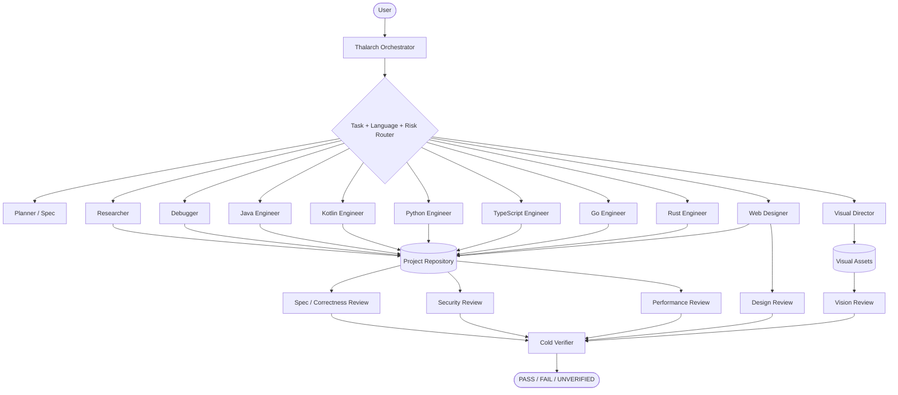

<div align="center">


<br/>

**High-rigor, project-agnostic polyglot engineering + visual design protocol for Google Antigravity.**

[](LICENSE)
[](#installation)
[](CHANGELOG.md)
[](.github/workflows/validate.yml)

</div>

---

## Why Thalarch?

Coding agents are capable, but their recurring failure modes are familiar: patching symptoms
before understanding causes, widening scope, inventing APIs from memory, writing generic code
that ignores the repository's language/toolchain, trusting their own implementation reports,
producing generic-looking UI, and declaring success from evidence that proves less than the
final claim.

**Thalarch** is an Antigravity-native multi-agent harness designed to reduce those failure modes.
It routes each task through the smallest relevant process, language, and domain stack; separates
planning, implementation, creative direction, review, and verification; and requires fresh
evidence before a result is called complete.

The core is intentionally **user-, repository-, language-, and framework-agnostic**. Language and
domain expertise is progressively disclosed only when the current project actually needs it.

> Thalarch improves the engineering process around the underlying model. It does not claim to
> change the model's intrinsic reasoning capability.

---

## 2.2 — Polyglot Engineering

Thalarch 2.2 adds a project-aware coding layer instead of asking one generic agent to pretend it
is equally specialized in every stack.

### Dedicated language specialists

| Language | Skill | Specialist agent |
| --- | --- | --- |
| Java / JVM | `thalarch-java` | `thalarch-java-engineer` |
| Kotlin / JVM / Android / KMP | `thalarch-kotlin` | `thalarch-kotlin-engineer` |
| Python | `thalarch-python` | `thalarch-python-engineer` |
| TypeScript / JavaScript | `thalarch-typescript` | `thalarch-typescript-engineer` |
| Go | `thalarch-go` | `thalarch-go-engineer` |
| Rust | `thalarch-rust` | `thalarch-rust-engineer` |

The router detects language/toolchain evidence from source files and build manifests. The
specialist then uses the repository's actual compiler/runtime, framework versions, package
manager, tests, and conventions instead of imposing a preferred stack.

### New engineering overlays

| Skill | Purpose |
| --- | --- |
| `thalarch-code-craft` | Universal anti-bloat, anti-hallucination, repository-native coding discipline |
| `thalarch-refactor` | Behavior-preserving refactors with characterization/baseline proof |
| `thalarch-performance` | Profile/benchmark-first performance engineering |
| `thalarch-api` | Contract-first API, compatibility, idempotency, retry, error semantics |
| `thalarch-data-sql` | Queries, ORM, transactions, migrations and data-safe rollout |
| `thalarch-dependency` | Dependency/framework/toolchain upgrades with version/API verification |

`thalarch-test` now also understands boundary matrices, property/metamorphic testing, fuzzing,
concurrency testing, and the difference between mock evidence and a real integration boundary.

---

## 2.1 — Creative Engineering

Thalarch also includes a full visual-production path:

- production website designer-engineer;
- semantic design-system extraction/creation;
- image task router;
- visual director with Antigravity's native `generate_image` tool;
- independent image/vision reviewer;
- independent website/UI design reviewer;
- browser QA with real screenshots and interaction evidence;
- exact-text, alpha, dimensions, brand/reference and before/after drift checks;
- deterministic SVG/code path when exact vector geometry is a better fit than raster generation.

Thalarch deliberately distinguishes **mockup**, **asset**, **implemented UI**, and **runtime
evidence**. A generated website mockup is not proof that the implemented site matches it.

See [CHANGELOG.md](CHANGELOG.md) for release notes.

---

## Architecture



The orchestrator intentionally has no project-write or shell-execution authority. Mutation and
executable checks are delegated to bounded specialists.

---

## Core engineering model

### 1. Route from evidence

Thalarch inspects repository rules, build markers, source languages, runtime/toolchain versions,
Git state, and real project commands before choosing a workflow.

The included project probe now reports source-language counts while skipping generated/build/cache
folders so large repositories can be oriented without blindly reading everything.

### 2. Use the smallest correct stack

Examples:

| Task | Typical stack |
| --- | --- |
| Small Java edit | Code Craft → Java → lightweight review |
| Kotlin coroutine bug | Debug → Kotlin → Test → Review → Verify |
| Python API feature | Spec → Python → API → Test → Review → Verify |
| TypeScript frontend bug | Debug → TypeScript → Browser QA → Review → Verify |
| Go concurrency regression | Debug → Go → Test/Race evidence → Performance review → Verify |
| Rust unsafe change | Rust → Security/Correctness review → targeted toolchain proof → Verify |
| Behavior-preserving cleanup | Refactor → language overlay → baseline/after tests → Review |
| Slow database endpoint | Performance → language → API/Data SQL → measurement → Verify |
| Framework/toolchain upgrade | Dependency → language/domain → compatibility matrix → broad verify |
| Full website | Design System → Web Design → TS/JS as relevant → Browser QA → Design Review |
| Custom hero artwork | Image → Imagegen → Vision Review |

### 3. Verify APIs instead of guessing

Language specialists are instructed to confirm version-sensitive runtime/framework/library APIs
from the repository itself, installed/resolved dependencies, existing call sites, generated types,
or current primary documentation.

A method that “looks right” but cannot be confirmed is `UNVERIFIED`, not production code by
confidence.

### 4. Code craft before cleverness

The universal `thalarch-code-craft` layer prioritizes:

**correctness → clarity → required robustness → maintainability → concision → micro-performance**.

It rejects speculative abstractions, accidental dependency growth, broad exception swallowing,
hardcoded fake-success implementations, unrelated refactors, and tests weakened just to turn a
check green.

Unlike rigid style packs, Thalarch does **not** impose universal line-count/argument-count rules
across every codebase. Repository conventions and real complexity decide structure.

---

## Language quality model

### Java / JVM

Project-version-aware use of Java language features, Maven/Gradle wrappers, exception/resource
semantics, concurrency, Spring only when present, ORM/persistence behavior, JUnit/integration
evidence, and JVM profiling rather than guessed tuning.

### Kotlin

Target-aware Kotlin/JVM/Android/KMP work with explicit coroutine scope ownership, cancellation,
Flow hot/cold semantics, dispatcher boundaries, Java interop, Compose only when present, and
runtime/device proof for Android behavior.

### Python

Runtime/package-manager-aware Python with idiomatic stdlib usage, typing without `Any` leakage,
async task/cancellation/resource discipline, framework APIs verified against installed versions,
and profiling before optimization. Thalarch does not force `uv`, Ruff, Pyright, FastAPI, or
Pydantic onto unrelated projects.

### TypeScript / JavaScript

Package-manager/runtime/framework-aware TS/JS with compiler strictness preserved, `unknown`
narrowing instead of casual `any`, browser/server boundaries, promise/cancellation/lifecycle
correctness, and real browser evidence for frontend behavior.

### Go

Simple repository-native Go with context propagation, goroutine ownership, channel close
ownership, error-chain semantics, race safety, `go test -race` when relevant, and pprof/benchmark
evidence before tuning.

### Rust

Cargo/toolchain/MSRV/feature-aware Rust with ownership understood rather than cloned away, explicit
unsafe invariants, error-source preservation, async runtime discipline, and target/feature-specific
verification.

---

## Testing model

Tests are selected by the contract, not by habit:

1. unit/pure;
2. property/state-machine/model;
3. component/module;
4. real integration boundary;
5. device/browser/end-to-end.

For suitable parsers, codecs, state machines and invariant-heavy logic, Thalarch can route to the
project's property/fuzz ecosystem. A fuzz failure is reduced to a deterministic regression case.

Mocks prove collaboration logic; they do not prove the external integration they replace.

---

## Performance model

Thalarch does not optimize from source aesthetics.

It defines a metric/workload/baseline, profiles or traces the real bottleneck, changes one causal
surface, and reruns the same workload. Unmeasured claims remain `UNVERIFIED`.

Typical priority:

1. eliminate unnecessary work/I/O;
2. fix algorithm/data shape;
3. batch/cache with explicit lifetime/invalidation;
4. reduce copies/serialization/allocation;
5. fix concurrency/backpressure;
6. tune runtime/framework;
7. micro-optimize only if evidence still points there.

---

## API and data model

`thalarch-api` treats endpoints/messages as compatibility contracts: validation, error semantics,
authentication vs authorization, idempotency, retry safety, pagination/order, timeouts,
cancellation, schema evolution and partial failures.

`thalarch-data-sql` treats schema/query changes as data changes: transaction semantics, ORM query
behavior, N+1/load boundaries, migration rollout, lock/backfill risk, stable pagination, query
plans and production-scale assumptions.

---

## Website quality model

For substantial websites:

1. ground audience/page job/information hierarchy;
2. choose a product-specific visual thesis;
3. extract/create semantic design system;
4. plan custom asset strategy;
5. implement in the existing stack;
6. run repository-native type/build/lint/test;
7. inspect the real site in Browser Subagent on compact + desktop viewports;
8. perform independent design review;
9. cold-verify the acceptance contract.

A page that could become a different product by swapping only its logo/text is not considered
sufficiently distinctive.

---

## Image quality model

Image work is classified before generation:

- inspect;
- generate;
- edit;
- compose;
- vector;
- capture;
- compare;
- annotate;
- optimize.

Reference images are labeled by role so a moodboard is not accidentally treated as the edit
target. “Change only X” requests lock the remaining invariants and are independently checked for
collateral drift.

---

## Agents

Thalarch 2.2 ships these specialist roles:

- orchestrator, planner, researcher, debugger, generic implementer, verifier;
- Java, Kotlin, Python, TypeScript, Go, Rust engineers;
- general/spec/security/performance reviewers;
- web designer, visual director, design reviewer, vision reviewer.

Review depth is proportional to risk. A one-line edit should not summon a council; a public API +
concurrency + database migration should not receive a one-line review.

---

## Installation

### Antigravity IDE — Windows

```powershell
.\INSTALL.ps1 -Target IDE
```

Installs to:

```text
%USERPROFILE%\.gemini\config\plugins\thalarch-mode
```

### Antigravity IDE — Linux / macOS

```bash
chmod +x ./INSTALL.sh
./INSTALL.sh IDE
```

Installs to:

```text
~/.gemini/config/plugins/thalarch-mode
```

### Antigravity CLI

```text
agy plugin install ./thalarch-mode
```

Or use `INSTALL.ps1 -Target CLI` / `./INSTALL.sh CLI`.

Restart/reload Antigravity and select `thalarch-orchestrator` as the primary agent.

---

## Usage

```text
Use Thalarch.

Work end-to-end. Detect the real project language/toolchain and route to the smallest relevant
specialist stack. Verify version-sensitive APIs instead of guessing them. Keep the diff minimal
and repository-native. Investigate root cause before fixing bugs. Use the real integration,
browser, device, database, or performance evidence when the acceptance criterion lives there.
Use independent review appropriate to risk and cold-verify the final acceptance criteria.
Do not push, merge, publish, deploy, or release unless I explicitly requested it.
```

### Polyglot example

```text
Use Thalarch. This repository has a Kotlin Android client and a Python backend. Change the shared
API contract end-to-end. Route each language surface to its specialist, keep one explicit contract
between them, test both sides independently, then run integration verification. Do not redesign
unrelated architecture.
```

### Website example

```text
Use Thalarch. Build this website end-to-end. Create a product-specific design system, generate
only imagery that genuinely improves the concept, implement it in the existing stack, verify
mobile and desktop in the real browser, and send final screenshots through independent design
review. Avoid generic AI-template aesthetics.
```

---

## Validation and evaluation

```bash
python validate_thalarch.py .
```

Expected:

```text
THALARCH VALIDATION PASSED
```

The validator checks skill/agent frontmatter, required creative and polyglot components,
structural image-tool delegation, portable paths, and stale branding. The project also ships
manual/eval prompts because longer prompts and more agents are not automatically better.

---

## Design heritage

Thalarch is an original Antigravity-native implementation. Engineering ideas are informed by
public patterns around staged execution, systematic debugging, surgical code generation,
idiomatic language overlays, clean-code/LLM-failure guards, independent review, specification-first
work, and cold verification. The polyglot update was additionally informed by the curated
`agentic-awesome-skills` collection and its Java/Python/Kotlin/super-code/review patterns.

Creative workflow ideas are informed by public frontend/design-system/design-review skill
patterns. Thalarch does not copy those projects' identity or claim equivalence with any
underlying model.

---

## License

Released under the [MIT License](LICENSE).
