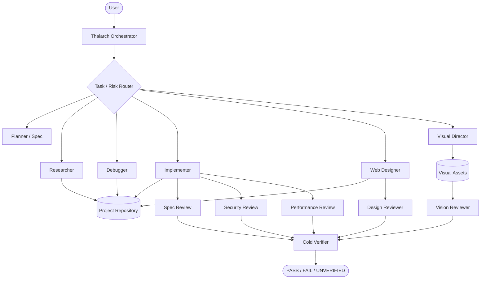

<div align="center">


<br/>

**High-rigor, project-agnostic engineering + visual design protocol for Google Antigravity.**

[](LICENSE)
[](#installation)
[](CHANGELOG.md)
[](.github/workflows/validate.yml)

</div>

---

## Why Thalarch?

Coding agents are capable, but the failure modes are familiar: patching symptoms
before understanding the cause, widening scope, overloading context, trusting
their own implementation reports, producing generic-looking UI, and declaring
success from evidence that proves less than the final claim.

**Thalarch** is an Antigravity-native multi-agent harness designed to reduce those
failure modes. It separates planning, implementation, creative direction, review,
and verification; routes each task through the smallest relevant specialist
stack; and requires fresh evidence before a result is called complete.

The core is intentionally **language-, framework-, repository-, and user-agnostic**.
Android, web, image generation, UI, browser, security, CI, and Git behavior live
in focused skills loaded only when relevant.

> Thalarch improves the process around the underlying model. It does not claim to
> change the model's intrinsic reasoning capability.

---

## 2.1 — Creative Engineering

Thalarch 2.1 adds a full visual-production path instead of treating design as a
small add-on to coding:

- **web designer-engineer** for production websites and frontend redesigns;
- **semantic design-system skill** for product-specific visual language;
- **image router** that chooses generation, editing, vector, capture, compare,
  annotation, or optimization instead of using generation for everything;
- **visual director** with Antigravity's native `generate_image` capability;
- **independent vision reviewer** for cold image QA;
- **web design reviewer** for hierarchy, craft, responsiveness, accessibility,
  image integration, and anti-template quality;
- **image generation protocol** with reference-role labeling and edit invariants;
- **visual QA protocol** for exact text, metadata, alpha, before/after drift,
  brand fidelity, and image artifacts;
- **Browser Subagent QA** for real screenshots, viewport checks, console/network
  evidence, and interaction recordings;
- read-only image metadata and optional pixel-diff utilities.

Thalarch deliberately distinguishes **mockup**, **asset**, **implemented UI**, and
**runtime evidence**. A generated website mockup is not proof that the real site
matches it.

See [CHANGELOG.md](CHANGELOG.md) for release notes.

---

## Architecture



The orchestrator is intentionally defined without project write tools and without
shell execution. Mutation and executable checks are delegated to bounded
specialists.

---

## Agents

| Agent | Purpose | Mutates files? |
| --- | --- | :---: |
| `thalarch-orchestrator` | Routes and coordinates the workflow | No |
| `thalarch-planner` | Acceptance contract, architecture, execution plan | No |
| `thalarch-researcher` | Current documentation, APIs, external contracts | No |
| `thalarch-debugger` | Root-cause investigation | No |
| `thalarch-implementer` | Executes one bounded engineering change | **Yes** |
| `thalarch-web-designer` | Designs and implements production web UI | **Yes** |
| `thalarch-visual-director` | Generates/edits raster images and deterministic visual assets | **Yes** |
| `thalarch-design-reviewer` | Independent website/UI design review | No |
| `thalarch-vision-reviewer` | Cold image/visual artifact review | No |
| `thalarch-reviewer` | Lightweight/general code review | No |
| `thalarch-review-spec` | Requirement compliance and correctness | No |
| `thalarch-review-security` | Security/trust-boundary review | No |
| `thalarch-review-performance` | Performance/concurrency review | No |
| `thalarch-verifier` | Cold acceptance verification | No |

Review depth is proportional to risk. Small changes stay small; visual and
security-sensitive work receive the extra specialists only when relevant.

---

## Skills

Thalarch uses progressive disclosure rather than one giant prompt.

### Core engineering

| Skill | Purpose |
| --- | --- |
| `thalarch-mode` | Core orchestration protocol |
| `thalarch-router` | Chooses the smallest relevant skill stack |
| `thalarch-spec` | Features, refactors, migrations, architecture |
| `thalarch-codebase-intel` | Large or unfamiliar repositories |
| `thalarch-debug` | Bugs, regressions, failures, flaky behavior |
| `thalarch-test` | Regression and falsifiable test design |
| `thalarch-review` | Evidence-first risk-sized review |
| `thalarch-security` | Auth, input, secrets, tools, dependencies, workflows |
| `thalarch-android` | Kotlin, Compose, Gradle, Media3, runtime/device work |
| `thalarch-ci` | Build pipelines, Actions, packaging/signing |
| `thalarch-git` | Branch, commit, push, PR and publication workflows |
| `thalarch-compound` | Distills verified reusable project knowledge |
| `thalarch-evals` | Benchmarks and retunes Thalarch itself |

### Web + visual design

| Skill | Purpose |
| --- | --- |
| `thalarch-design-system` | Extracts/creates the product's semantic visual language |
| `thalarch-web-design` | Distinctive production websites and frontend implementation |
| `thalarch-ui` | UI/UX composition and product interaction design |
| `thalarch-browser-qa` | Real browser flow, screenshots, console/network, responsive QA |
| `thalarch-image` | Routes image work to the correct production method |
| `thalarch-imagegen` | High-discipline raster generation/editing |
| `thalarch-visual-qa` | Cold visual inspection, comparison, metadata and drift checks |

### Example routing

| Task | Typical stack |
| --- | --- |
| Small safe edit | Review only |
| Bug/regression | Debug → Test → Review → Verify |
| Multi-file feature | Spec → Test → Review → Verify |
| Architecture | Spec → Codebase Intel → Deep Review → Verify |
| Full website | Design System → Web Design → Browser QA → Design Review → Verify |
| UI redesign | Spec → UI → Browser/Runtime QA → Visual Review → Verify |
| Generate hero artwork | Image → Imagegen → Vision Review |
| Precise photo edit | Image → Imagegen → Before/After Visual QA |
| Website + custom imagery | Design System → Web Design + Imagegen → Asset QA → Integration → Browser QA → Design Review |
| Exact logo/icon/diagram | Image router → deterministic SVG/code path → Visual QA |
| Security-sensitive change | Security → Review Council → Verify |
| CI failure | CI → Security when relevant → Review → Verify |
| Publish branch/PR | Git → Review → Verify remote state |

---

## Website quality model

For substantial websites, Thalarch works in stages:

1. **Ground the product** — audience, page job, information hierarchy.
2. **Choose a visual thesis** — a specific aesthetic direction and one memorable
   idea that belongs to this product.
3. **Extract/create the design system** — typography, color roles, geometry,
   components, layout, motion, imagery, responsive behavior, anti-patterns.
4. **Plan the asset strategy** — reuse real assets, generate raster imagery only
   when useful, prefer SVG/code for exact vector work.
5. **Implement in the existing stack** — no framework rewrite just for styling.
6. **Run repository checks** — type/build/lint/test as relevant.
7. **Open the real site in Antigravity's Browser Subagent** — compact + desktop,
   primary flow, screenshots, console/network checks.
8. **Independent design review** — hierarchy, craft, responsive behavior,
   accessibility, image integration and performance-sensitive visual choices.
9. **Cold verification** — PASS / FAIL / UNVERIFIED against the actual acceptance
   contract.

A page that could become a different product by swapping the logo is not
considered sufficiently distinctive.

---

## Image quality model

Thalarch does not send every visual request blindly to an image generator.

It first classifies the work as:

- inspect;
- generate;
- edit;
- compose;
- vector;
- capture;
- compare;
- annotate;
- optimize.

`thalarch-visual-director` can use Antigravity's native `generate_image` tool for
raster generation and semantic edits. Reference images are labeled by role — edit
target, style reference, composition reference, identity reference, brand/palette
reference, source, or comparison baseline — so an attached moodboard is not
accidentally treated as something to edit.

For "change only X" edits, Thalarch restates locked invariants on every pass and
then independently checks for collateral drift.

For exact logos, diagrams, UI geometry, charts, and typography, deterministic
SVG/code-native construction is preferred when it gives stronger guarantees.

---

## Visual verification utilities

The visual QA skill ships small read-only helpers:

```bash
python thalarch-mode/skills/thalarch-visual-qa/scripts/image_probe.py image.png
```

Reports supported format, dimensions, aspect ratio, file size and alpha knowledge
without external Python packages.

Optional decoded pixel comparison:

```bash
python thalarch-mode/skills/thalarch-visual-qa/scripts/image_compare.py before.png after.png --out diff.png
```

Pixel comparison uses Pillow **only if already installed**. If it is missing, the
script reports the comparison as unverified instead of silently installing a
dependency.

Mechanical checks complement visual judgment; they do not replace it.

---

## The core execution loop

1. **Route** — classify task and risk before loading heavy instructions.
2. **Understand** — read rules and the smallest necessary project surface.
3. **Specify** — convert intent into observable acceptance criteria.
4. **Investigate** — for failures, establish causal evidence before editing.
5. **Create / Implement** — bounded code or visual production.
6. **Review** — use independent technical/design/visual lenses sized to risk.
7. **Verify** — cold-check acceptance criteria with fresh evidence.
8. **Compound** — retain only reusable, evidence-backed lessons.

A successful compile proves compilation. A prompt proves intent. Neither proves
runtime behavior or final visual quality.

---

## Installation

### Antigravity IDE — Windows

```powershell
.\INSTALL.ps1 -Target IDE
```

Installs to:

```text
%USERPROFILE%\.gemini\config\plugins\thalarch-mode
```

### Antigravity IDE — Linux / macOS

```bash
chmod +x ./INSTALL.sh
./INSTALL.sh IDE
```

Installs to:

```text
~/.gemini/config/plugins/thalarch-mode
```

### Antigravity CLI

```text
agy plugin install ./thalarch-mode
```

Or use `INSTALL.ps1 -Target CLI` / `./INSTALL.sh CLI`.

After installation, restart/reload Antigravity and select
`thalarch-orchestrator` as the primary agent.

For real web verification, enable Antigravity Browser tools; the Browser Subagent
can capture screenshots and recordings of the implemented site.

---

## Usage

```text
Use Thalarch.

Work end-to-end. Route this task to the smallest relevant skill stack.
Keep the implementation specific to this product rather than generic.
For visual work, establish the design direction before implementation.
For image work, preserve reference roles and edit invariants.
Use real browser/device/image evidence where the acceptance criterion is visual.
Use independent review appropriate to the risk.
Cold-verify the final acceptance criteria.
Do not push, merge, publish, deploy, or release unless I explicitly requested it.
```

### Website example

```text
Use Thalarch. Build this website end-to-end.
Create a product-specific design system, generate only the imagery that genuinely
improves the concept, implement it in the existing stack, verify mobile and desktop
in the real browser, and send the final screenshots through independent design review.
Avoid generic AI-template aesthetics.
```

### Image-edit example

```text
Use Thalarch. Change only the jacket from red to black in the provided image.
Keep identity, pose, framing, background and lighting unchanged. Compare the final
result with the original and reject collateral drift.
```

---

## Safety and evidence invariants

- **No unauthorized external actions.** Push, merge, publish, deploy, release,
  credential/permission changes, and destructive operations require authorization.
- **Root cause before symptom patching.** Bugs require causal evidence.
- **Implementers/creators do not self-certify.** Final status comes from independent evidence.
- **Reviewer findings are hypotheses until confirmed.** Speculation does not become churn.
- **PASS / FAIL / UNVERIFIED stay distinct.** Missing proof is not proof of success.
- **Scope is binding.** Unrequested cleanup or visual redesign is surfaced separately.
- **Prompts are not proof.** Final pixels and real runtime behavior are inspected.

### Optional consequential-command hook

`thalarch-mode/hooks.json` includes a disabled hook that can force confirmation
for consequential commands such as push, merge, release/publish, destructive
recursive deletion, and deployment operations.

It is disabled by default because plugin hooks affect every session in which they
are enabled.

---

## Validation and evaluation

```bash
python validate_thalarch.py .
```

Expected:

```text
THALARCH VALIDATION PASSED
```

The repository also runs the validator through GitHub Actions.

`thalarch-evals` and [TEST-PROMPTS.md](TEST-PROMPTS.md) include design/image cases
because a longer prompt is not automatically a better skill. Visual additions
should improve routing, distinctiveness, fidelity, scope preservation, browser
proof, or review honesty on representative tasks.

---

## Repository structure

```text
antigravity-thalarch/
├── .github/workflows/validate.yml
├── assets/branding/
├── thalarch-mode/
│   ├── agents/
│   ├── hooks/
│   ├── skills/
│   ├── hooks.json
│   └── plugin.json
├── CHANGELOG.md
├── DESIGN-NOTES.md
├── INSTALL.ps1
├── INSTALL.sh
├── LICENSE
├── MANIFEST.txt
├── README.md
├── TEST-PROMPTS.md
└── validate_thalarch.py
```

---

## Design heritage

Thalarch is an original Antigravity-native implementation. Its creative workflow
was informed by public agent-skill patterns including Anthropic's distinctive
frontend-design methodology, Google Stitch's semantic design-system / design
iteration skills, Microsoft's frontend design-review framework, and Vercel's web
interface review guidelines. Engineering behavior is also informed by staged
execution, systematic debugging, independent review, and cold verification
patterns.

Thalarch does not copy those projects' identity or claim equivalence with any
underlying model.

---

## License

Released under the [MIT License](LICENSE).
