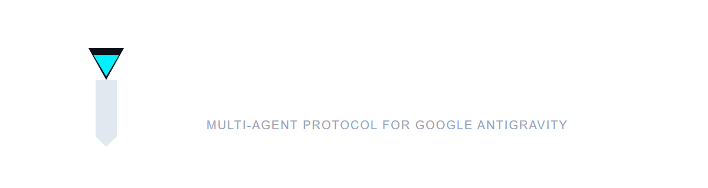
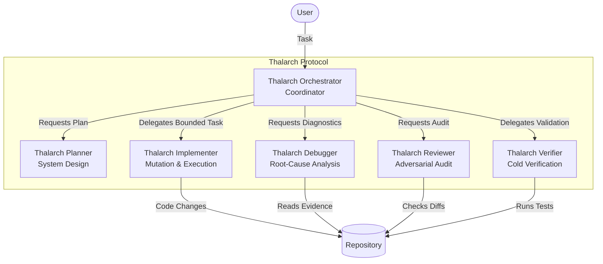

<div align="center">



<br/>

**High-rigor multi-agent engineering protocol for Google Antigravity.**

[](https://opensource.org/licenses/MIT)
[](#installation--setup)
[](#)

</div>

---

## 🌊 Why Thalarch?

LLMs fail when left unconstrained. Traditional single-agent architectures suffer from self-certified patches, context bloat, speculative bug fixing, and widening scope creep.

**Thalarch Mode** is a structural separation of powers for the Antigravity ecosystem. By strictly partitioning access to tools and introducing evidence-backed verification, Thalarch forces rigorous engineering discipline into the multi-agent loop. The system mandates investigation before mutation, ensures implementation is bounded, and requires adversarial review prior to acceptance.

---

## 🏛️ Core Philosophy & Architectural Principles

- **Structural Delegation:** The orchestrator has no write tools and no shell execution capability. It cannot quietly implement tasks inline. It is forced to delegate.
- **Separate Truth Channels:** The implementer's reasoning is not proof. Thalarch relies on implementation evidence, independent engineering review, and cold requirement verification.
- **Progressive Disclosure:** Deep context is scoped to the relevant domain (debugging, UI, etc.) avoiding context pollution for the main orchestrator.
- **Scope Discipline:** Unrequested cleanup is treated as a risk, not a bonus. Minimal surface area is strictly enforced.
- **Evidence Language:** Thalarch agents use distinct `PASS`, `FAIL`, and `UNVERIFIED` statuses to prevent "could not prove" from becoming "probably okay."

---

## 🕸️ Multi-Agent Topology & System Architecture



---

## 🎭 The 6 Specialized Roles

| Role | Responsibilities | Tool Permissions |
| --- | --- | --- |
| **Orchestrator** | Coordinates the entire execution loop. Resolves disagreements. Cannot edit files or run shell commands. | `send_message`, `manage_task` |
| **Planner** | Drafts structural plans for complex changes. Breaks down tasks. | Read-only |
| **Debugger** | Hypothesizes and proves root causes using tests and logs before edits. | Read-only, `run_command` |
| **Implementer** | Receives bounded tasks. Modifies the codebase with minimal surface area. | `write_to_file`, `replace_file_content` |
| **Reviewer** | Adversarial review. Finds edge cases and unhandled state. | Read-only |
| **Verifier** | Independent, cold-context evaluation against initial requirements. | Read-only, `run_command` |

---

## 🔄 The 7-Phase Protocol Execution Cycle

1. **Preflight:** Workspace analysis and context loading.
2. **Plan:** Structural planning (for feature requests).
3. **Investigate:** Root-cause hypothesis generation and evidence gathering (for bugs).
4. **Implement:** Execution of isolated, strictly bounded edits.
5. **Review:** Adversarial inspection of the diffs.
6. **Cold Verification:** Independent check of `PASS` / `FAIL` against initial constraints.
7. **Auditable Delivery:** Final summary provided to the user without unauthorized external actions.

---

## 🚀 Installation & Setup

### Antigravity IDE / Antigravity 2.0 (Global)

Run the included PowerShell installer from the repository root:
```powershell
.\INSTALL.ps1 -Target IDE
```
*(Alternatively, copy `thalarch-mode` manually to `~/.gemini/config/plugins/thalarch-mode/`)*

### Antigravity CLI

Run the automated installer:
```powershell
.\INSTALL.ps1 -Target CLI
```
*(Alternatively, from the extracted package root, run: `agy plugin install .\thalarch-mode`)*

### Post-Installation
1. Restart/reload Antigravity.
2. Open the Agents panel and look for `thalarch-orchestrator`.
3. Set it as your primary agent or prompt: *"Use Thalarch Mode for this task."*

---

## 💡 Usage & Recommended Prompts

For the highest determinism, explicitly activate the mode in your prompt:

> `"Use Thalarch Mode. Work end-to-end, investigate root cause before editing, keep the diff minimal, use independent review and cold verification, and do not push/merge/release unless I explicitly ask for it."`

**Feature Prompt Example:**
> `"Use Thalarch Mode. Implement user authentication using JWT. Do not refactor the existing database schema."`

**Bugfix Prompt Example:**
> `"Use Thalarch Mode. The app crashes when a null username is submitted. Investigate the root cause, fix it without touching unrelated files, and verify the fix."`

---

## 📂 Repository Structure

```text
antigravity-thalarch/
├── assets/
│   └── branding/         # High-resolution protocol SVG/PNG assets
├── thalarch-mode/
│   ├── agents/           # The 6 distinct specialized agents
│   ├── skills/           # Domain-specific protocols (UI, Android, Context)
│   └── plugin.json       # Antigravity plugin manifest
├── DESIGN-NOTES.md       # Extended architectural philosophy
├── INSTALL.ps1           # Quick setup script
├── MANIFEST.txt          # Verified repository file list
├── README.md             # This document
└── TEST-PROMPTS.md       # Example prompts for evaluating system behavior
```

---

## 🛡️ Safety Invariants & Verification Standards

Thalarch strictly forbids specific classes of action:
1. **No unauthorized external actions:** Committing, pushing, merging, deploying, or deleting external data requires explicit user authorization.
2. **Cold Verification:** The Verifier acts without inheriting the Implementer's biased context.
3. **Strict Bounds:** Drive-by refactoring is disabled by default.

---

## 🧬 Design Heritage & Inspirations

Thalarch Mode conceptually builds on the ideas of:
- `mrtooher/fable-mode` - Staged execution, structural delegation, cold verifier.
- `obra/superpowers` - Systematic debugging, subagent-driven development, verification-before-completion.
- **Google Antigravity** native primitives: Skills, custom Subagents, Artifacts, worktrees, and tool-permission architecture.

*(This package is an original native implementation for the Antigravity architecture, not a fork of the aforementioned projects).*

---

## 📄 License

This project is open-source and available under the **MIT License**.
