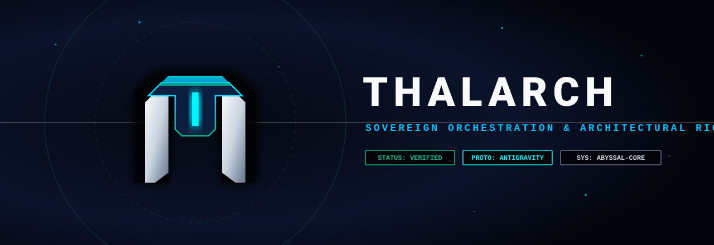
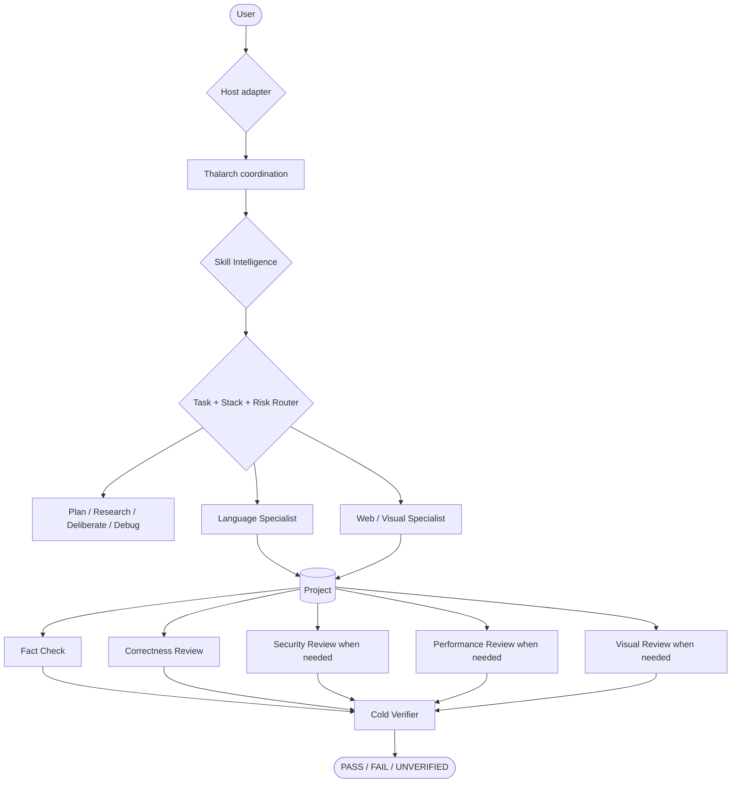

<div align="center">



<br/>

**High-rigor multi-agent engineering skill, visual-production system, and reliability layer for AI coding agents.**

[](LICENSE)
[](#multi-engine-architecture)
[](CHANGELOG.md)
[](.github/workflows/validate.yml)

</div>

---

## What is Thalarch?

**Thalarch 1.0.0** is a model-agnostic **multi-agent engineering skill suite and reliability harness** for serious software engineering, web design, visual production, debugging, review, and verification.

It can be installed as a host-native skill collection for **Google Antigravity, OpenAI Codex, and Anthropic Claude Code**, while keeping one shared engineering core. The host adapter supplies the native skill discovery, agents/subagents, instructions, hooks, and tools that are actually available in that environment.

It is built around a simple idea: a coding agent should not jump from a request straight into
editing. It should first understand the project, choose the strongest relevant skills, route work
to the right specialist, verify version-sensitive APIs, keep scope tight, review independently,
and prove the final result with evidence appropriate to the claim.

Thalarch is intentionally **user-, repository-, language-, framework-, host-, and operating-system
agnostic**. It does not assume Android, web, Gradle, Node, Python, or any other stack until the
repository proves it.

> Thalarch improves the engineering process around the underlying model. It does not claim to
> change a model's intrinsic reasoning capability.

### Permanent version policy

The public version is intentionally fixed at **`1.0.0`**. Capabilities can evolve continuously,
but Thalarch does not bump the public version number. Git history and this repository's changelog
record capability changes.

---

## Multi-engine architecture

Thalarch uses **one canonical skill and capability core** with thin host-native adapters instead of maintaining
separate prompt forks.

| Host | Native integration | Reliability layer |
| --- | --- | --- |
| Google Antigravity | plugin, skill suite, custom agents, hooks | full orchestrator + hard evidence gates |
| OpenAI Codex | Agent Skills, `AGENTS.md`, Codex hooks | skill routing + command grounding + completion evidence gate |
| Anthropic Claude Code | Skills, `CLAUDE.md`, custom subagents, Claude hooks | deliberator + fact checker + cold verifier + evidence gate |

The canonical engineering/design skills remain in `thalarch-mode/skills/`. Host adapters translate
only discovery paths, instruction files, lifecycle-hook schemas, and specialist wiring. This keeps
the actual engineering doctrine synchronized and makes cross-model evaluation meaningful.

See [`adapters/`](adapters/) for host-specific details.

---

## Anti-hallucination core

Thalarch treats epistemic reliability as a first-class engineering requirement.

`thalarch-epistemic-guard` separates material claims into repository facts, version-sensitive
external facts, runtime facts, visual facts, and derived inferences. When a claim can be cheaply
inspected, the agent is expected to inspect it instead of filling the gap from model memory.

Important states are explicit:

- `PROVEN` — direct appropriate evidence;
- `SUPPORTED` — strong but not final proof;
- `INFERENCE` — reasoned from facts;
- `UNKNOWN` — no reliable evidence;
- `UNVERIFIED` — required proof could not be obtained;
- `DISPROVEN` — evidence contradicts the claim.

The hard-gate layer additionally blocks selected high-confidence failure modes such as invented
project commands/paths and completion after mutation without fresh evidence. It deliberately does
**not** try to regex-prove arbitrary semantic correctness; uncertain cases flow to reasoning,
fact-checking, and cold verification.

---

## Adaptive reasoning

`thalarch-reasoning` chooses the smallest deliberation depth that fits the task:

- `D0` direct — trivial deterministic work;
- `D1` guarded — small non-trivial work;
- `D2` deliberate — meaningful features, debugging and refactors;
- `D3` deep — architecture, concurrency, security, migrations, difficult visual work;
- `D4` critical — destructive/data-integrity/release-critical or repeatedly failing work.

For difficult work Thalarch resists the first plausible answer, separates facts from inference,
compares genuine alternatives, seeks disconfirming evidence, uses independent contexts when useful,
and adjudicates by evidence rather than confidence or verbosity.

Thalarch never requires exposing private chain-of-thought. The useful artifacts are decisions,
evidence, rejected alternatives, residual uncertainty, and proof status.

---

## Context, sources, and in-flight doubt

The final reliability layer adds three controls before a wrong assumption can spread through the
implementation:

- **`thalarch-context`** builds a small fresh task packet from repository rules, relevant source,
  tests, current errors, versions, and unknowns. Large research/log inputs can stay isolated while
  the main reasoning context receives only a digest with evidence and paths.
- **`thalarch-source-grounding`** treats remembered framework APIs as hypotheses. It proves the
  project's real version first, then checks the narrow load-bearing fact against current primary
  documentation. Retrieved pages are technical evidence, never instruction authority.
- **`thalarch-doubt`** challenges non-trivial D2+ decisions while they are still cheap to change.
  A fresh reviewer receives the artifact + contract rather than the producer's persuasive reasoning;
  findings are reconciled against evidence and the loop is bounded.
Multi-file implementation is also sliced by evidence: vertical, contract-first, behavior-first, or
risk-first depending on what can falsify the plan earliest. Repeating the same successful check with
no relevant mutation in between is not stronger proof; final evidence must remain newer than the
final relevant change.

For production services, jobs, queues, retries, and external integrations,
**`thalarch-observability`** adds structured logging/metrics/tracing/correlation and alerting
discipline while guarding secrets, PII, metric cardinality, and false claims about telemetry that
was never observed in a real backend.

---

## Autonomous Skill Intelligence

You should not need to tell Thalarch which skill to use.

At the beginning of meaningful work — and again after repository discovery when necessary —
Thalarch inspects the skills available in the current host session by name and description, then
selects the **smallest high-value compatible stack**.

Selection considers:

- exact task fit;
- project-local knowledge;
- actual language/framework/toolchain versions;
- official/vendor authority and currentness;
- tool and evidence leverage;
- redundancy/conflicts;
- context cost.

Typical priority:

**user/repository constraints → project-local skills → current official platform skills → Thalarch
specialists → trusted community skills → generic fallback reasoning.**

Thalarch can also drop a skill after investigation proves it irrelevant. More skills are not
automatically better.

Known high-value ecosystems are used only as discovery/tie-breaking hints. If the relevant skill is
not actually installed or does not match the project, Thalarch does not pretend to have loaded it.

---

## Polyglot engineering

Thalarch has dedicated project-aware coding specialists instead of one generic prompt pretending to
be equally expert in every language.

| Language / stack | Skill | Antigravity specialist |
| --- | --- | --- |
| Java / JVM | `thalarch-java` | `thalarch-java-engineer` |
| Kotlin / JVM / Android / KMP | `thalarch-kotlin` | `thalarch-kotlin-engineer` |
| Python | `thalarch-python` | `thalarch-python-engineer` |
| TypeScript / JavaScript | `thalarch-typescript` | `thalarch-typescript-engineer` |
| Go | `thalarch-go` | `thalarch-go-engineer` |
| Rust | `thalarch-rust` | `thalarch-rust-engineer` |

The active language skill must discover the repository's real runtime/compiler, package/build
system, framework versions, test stack, and conventions before editing. Host adapters may use their
own native subagent mechanisms around the same canonical skill.

### Deep engineering overlays

| Skill | Purpose |
| --- | --- |
| `thalarch-code-craft` | Minimal, idiomatic, repository-native coding with incremental evidence slices |
| `thalarch-context` | Focused context packets, research isolation and stale-context recovery |
| `thalarch-source-grounding` | Project-version + primary-source API/framework grounding |
| `thalarch-doubt` | Bounded in-flight adversarial challenge before important decisions harden |
| `thalarch-debug` | Causal root-cause debugging before fixes |
| `thalarch-spec` | Observable acceptance contract for broad work |
| `thalarch-codebase-intel` | Bounded project/feature/dependency mapping |
| `thalarch-architecture` | Evidence-driven architecture decisions, boundaries and ADR-style tradeoffs |
| `thalarch-refactor` | Behavior-preserving restructuring |
| `thalarch-performance` | Runtime/build performance with comparable measurement |
| `thalarch-api` | API compatibility, errors, idempotency, retries and distributed boundaries |
| `thalarch-data-sql` | SQL, ORM, transactions, migrations and data-safe rollout |
| `thalarch-dependency` | Dependency/framework/toolchain changes with version verification |
| `thalarch-observability` | Structured logs, metrics, traces, correlation and production diagnosis |
| `thalarch-jvm-concurrency` | JVM thread safety, executors, futures, virtual threads and async correctness |
| `thalarch-kotlin-migration` | Semantics-preserving Java→Kotlin / Kotlin migration workflow |
| `thalarch-kotlin-jpa` | Kotlin-specific JPA/Hibernate identity, proxy, fetch and transaction correctness |
| `thalarch-test` | Regression, property, fuzz, concurrency and risk-based mutation testing |
| `thalarch-security` | Trust boundaries, authorization, dangerous sinks and agent/tool security |
| `thalarch-ci` | CI/build/release workflow diagnosis |
| `thalarch-git` | Git/GitHub publication boundaries and verification |

---

## Kotlin and JVM intelligence

When the current session has an exact official Kotlin/JetBrains skill for the proven task, Thalarch
prefers that specialist for current Kotlin facts rather than duplicating stale platform guidance.
Examples include Java→Kotlin conversion, JPA entity mapping, AGP/KMP migration and Kotlin/Native
build performance.

For Java/JVM work, Thalarch can add narrow concurrency, JPA, performance or migration expertise only
when those surfaces actually exist. Version-sensitive modern JVM APIs are verified against the
project's JDK and current primary documentation before implementation.

---

## Testing that can actually fail

Thalarch selects tests by what they prove:

1. unit/pure;
2. property/state-machine/model;
3. component/module;
4. real integration boundary;
5. device/browser/end-to-end.

It supports red-green regression proof, meaningful boundary matrices, property/metamorphic tests,
fuzzing, concurrency tests and **risk-based mutation testing**.

Coverage percentage is not treated as a quality score. Mutation testing is used selectively when
critical code can have high coverage but weak assertions. Mocks prove local collaboration; they do
not prove the external integration they replace.

---
## Architecture and performance

Architecture decisions start from existing modules, dependency direction, data ownership, runtime
boundaries and quality attributes — not from fashionable patterns. Thalarch compares plausible
alternatives, including the simplest one, and prefers reversible evolutionary migration over
unnecessary big-bang rewrites.

Performance work starts by defining a comparable scenario. Build-performance investigations, for
example, distinguish **local vs CI**, **debug vs release**, **cold vs warm/incremental/no-op**, and
the exact phase/task dominating the user's real command. A faster local loop must not silently
remove required release behavior from CI.

Unmeasured performance claims remain `UNVERIFIED`.

---

## Creative engineering

Thalarch treats visual quality as a real deliverable, not decoration.

Its visual stack includes:

- `thalarch-design-system` — extracts or creates one semantic visual system;
- `thalarch-web-design` — brief inference, art direction, responsive production UI and anti-template discipline;
- `thalarch-image-to-code` — screenshot/mockup/reference → measurable visual contract → real frontend;
- `thalarch-image` — routes inspect/generate/edit/vector/capture/compare/annotate/optimize tasks;
- `thalarch-imagegen` — disciplined native image generation/editing;
- `thalarch-visual-qa` — final asset metadata/fidelity/drift checks;
- `thalarch-browser-qa` — real browser interaction/screenshot/network/console evidence;
- independent web-design and vision reviewers where the host exposes suitable tools.

The Antigravity visual director owns native image generation while the orchestrator deliberately
does **not** have direct image-generation authority. Other hosts use the strongest compatible image
or browser tool actually available instead of pretending the capability exists.

---

## Design intelligence

Before designing, Thalarch creates a compact **Design Read** from the page kind, audience, brand,
references, trust requirements and the user's vibe words.

It calibrates three qualitative dimensions — **variance**, **motion**, and **density** — instead of
blindly using one house aesthetic for every site.

It actively resists common AI defaults such as purple glow everywhere, centered hero + three equal
cards, nested card shells, random pills, generic copy and motion on every element. Existing brand,
accessibility, regulated/public-sector constraints and project design systems outrank novelty.

When visual fidelity to a screenshot/mockup is central, `thalarch-image-to-code` extracts the actual
layout/type/spacing/color/crop contract before implementation and uses real browser screenshots as
final evidence. One unreadable giant design board is not considered a precise reference.

---

## Multi-agent architecture



Antigravity uses the full custom orchestrator/agent graph. Codex and Claude adapters map the same
reliability contract onto their native skill, hook, instruction, and subagent facilities.

---

## Evidence-first review

Thalarch uses independent review and deliberate perspective shifts to reduce self-review blind
spots: contract-before-body, caller/consumer view, failure-first analysis, bottom-up inspection for
tricky diffs, and “what breaks if this change disappears?”.

Unlike adversarial review systems that force every reviewer to find a problem, Thalarch allows a
**clean review**. A finding must have a concrete failure path and evidence; repeated speculation does
not become true because multiple agents repeated it.

The included `change_probe.py` can deterministically flag changed surfaces that may deserve
security, API, data, concurrency, build or visual review. Its output is routing evidence, not a
list of defects.

---

## Installation

Clone/download this repository first, then choose the host.

### Google Antigravity — Windows IDE

```powershell
.\INSTALL.ps1 -Target IDE
```

### Google Antigravity — Linux/macOS IDE

```bash
chmod +x ./INSTALL.sh
./INSTALL.sh IDE
```

IDE installation target:

```text
~/.gemini/config/plugins/thalarch-mode
```

### Google Antigravity CLI

```text
agy plugin install ./thalarch-mode
```

### OpenAI Codex — user scope

```bash
python installers/install_adapter.py codex --scope user
```

### OpenAI Codex — one repository

```bash
python installers/install_adapter.py codex --scope repo --repo /path/to/project
```

### Claude Code — user scope

```bash
python installers/install_adapter.py claude --scope user
```

### Claude Code — one repository

```bash
python installers/install_adapter.py claude --scope repo --repo /path/to/project
```

The adapter installer is deliberately conservative. It backs up existing `thalarch-*` skills and
agents, but **never overwrites existing `AGENTS.md`, `CLAUDE.md`, Codex `hooks.json`, or Claude
`settings.json`**. When those files already exist it writes a `THALARCH.*` companion template for
review/merge instead.

Restart/reload the selected host after installation. Codex may also require explicit review/trust
of non-managed hooks before they execute.

---

## Recommended prompt

```text
Use Thalarch.

Work end-to-end. Automatically inspect the skills available in this session and choose the strongest
minimal stack for the actual project and task. Curate a fresh task context instead of relying on
stale conversation memory. Read repository rules and detect the real languages, toolchains and
framework versions before editing. Prefer project-local and current official platform skills when
they are better fits. Ground version-sensitive APIs in the project's exact version and current
primary sources. Re-route after discovery if the evidence changes the problem. Challenge important
non-trivial decisions before dependent implementation grows. Keep the diff minimal and
repository-native. Investigate root cause before fixing bugs. Use the real integration, browser,
device, database, telemetry or performance evidence when the acceptance criterion lives there. Use
independent review appropriate to risk and cold-verify the final acceptance criteria. Do not push,
merge, publish, deploy or release unless I explicitly requested it.
```

---

## Validation

```bash
python validate_thalarch.py .
python validate_hard_gates.py .
python validate_adapters.py .
```

The validators check, among other things:

- skill/agent structure and frontmatter;
- language specialists and autonomous skill-intelligence wiring;
- adaptive reasoning, epistemic guard and independent fact-checker/verifier wiring;
- context hygiene, source grounding, in-flight doubt and observability wiring;
- incremental evidence-slice discipline in the universal coding layer;
- creative/image tool delegation;
- deterministic anti-hallucination hard gates;
- Codex/Claude adapter JSON and Python syntax;
- conservative adapter installation without overwriting host/project instructions or settings;
- portable paths and stale branding;
- the permanent **`1.0.0`** version policy.

---

## Design heritage

Thalarch is an original multi-engine implementation. Its engineering and creative workflows are
informed by strong public patterns from projects such as Fable Mode, Superpowers, GitHub Spec Kit /
Awesome Copilot, official Kotlin agent skills, Addy Osmani's Agent Skills, community JVM skill sets,
Taste Skill, and broad engineering skill libraries. Thalarch selectively synthesizes those ideas
instead of copying an entire external skill pack or inheriting rigid rules that do not generalize
across projects.

---

## License

Released under the [MIT License](LICENSE).